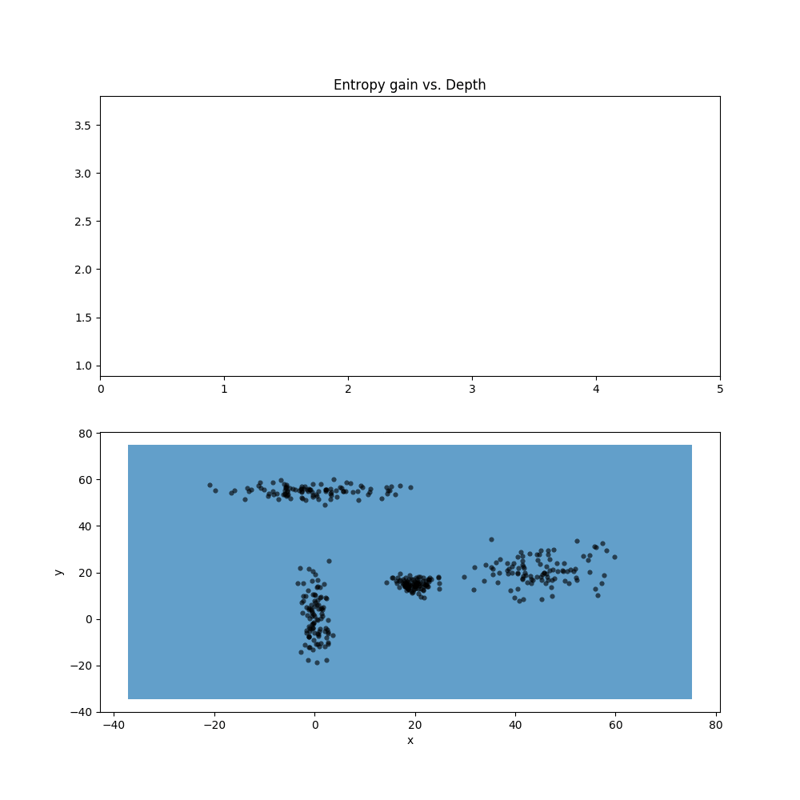
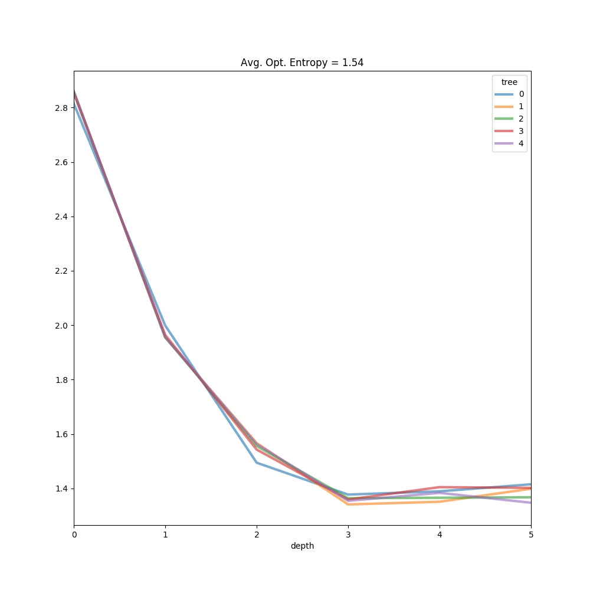
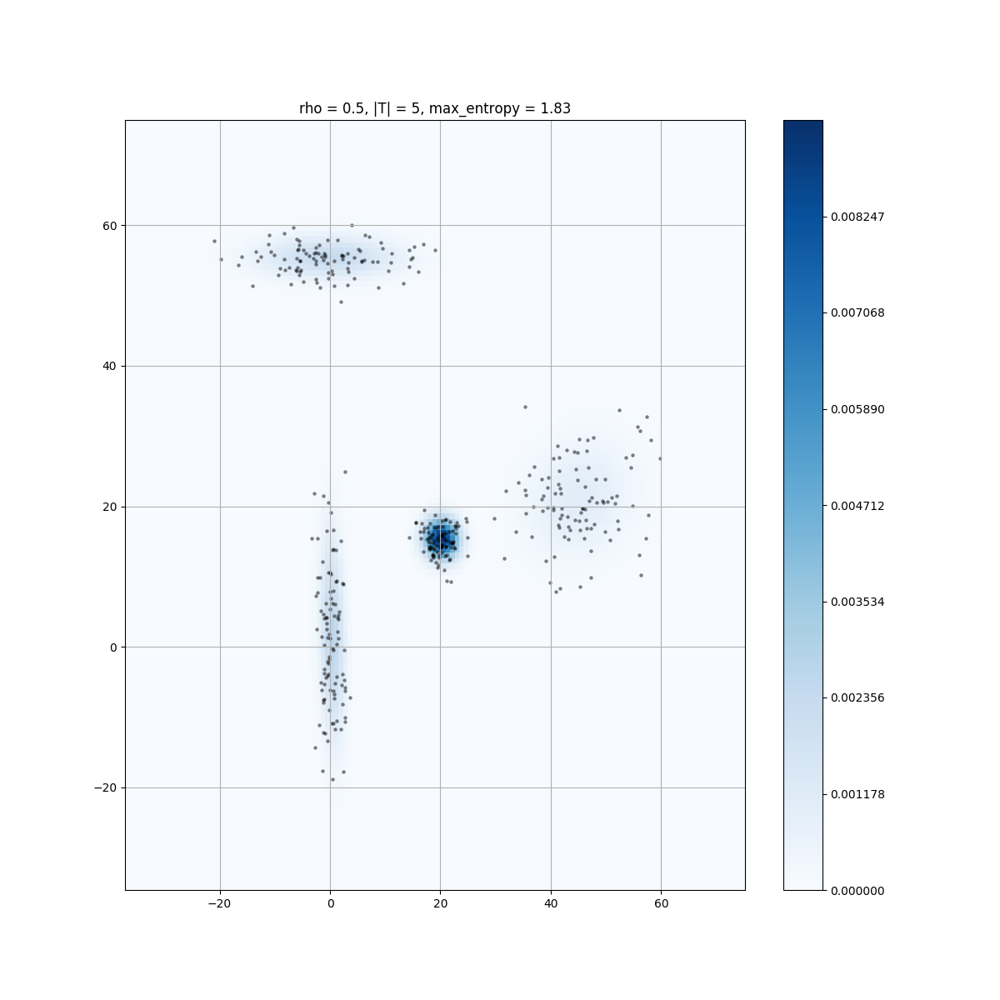
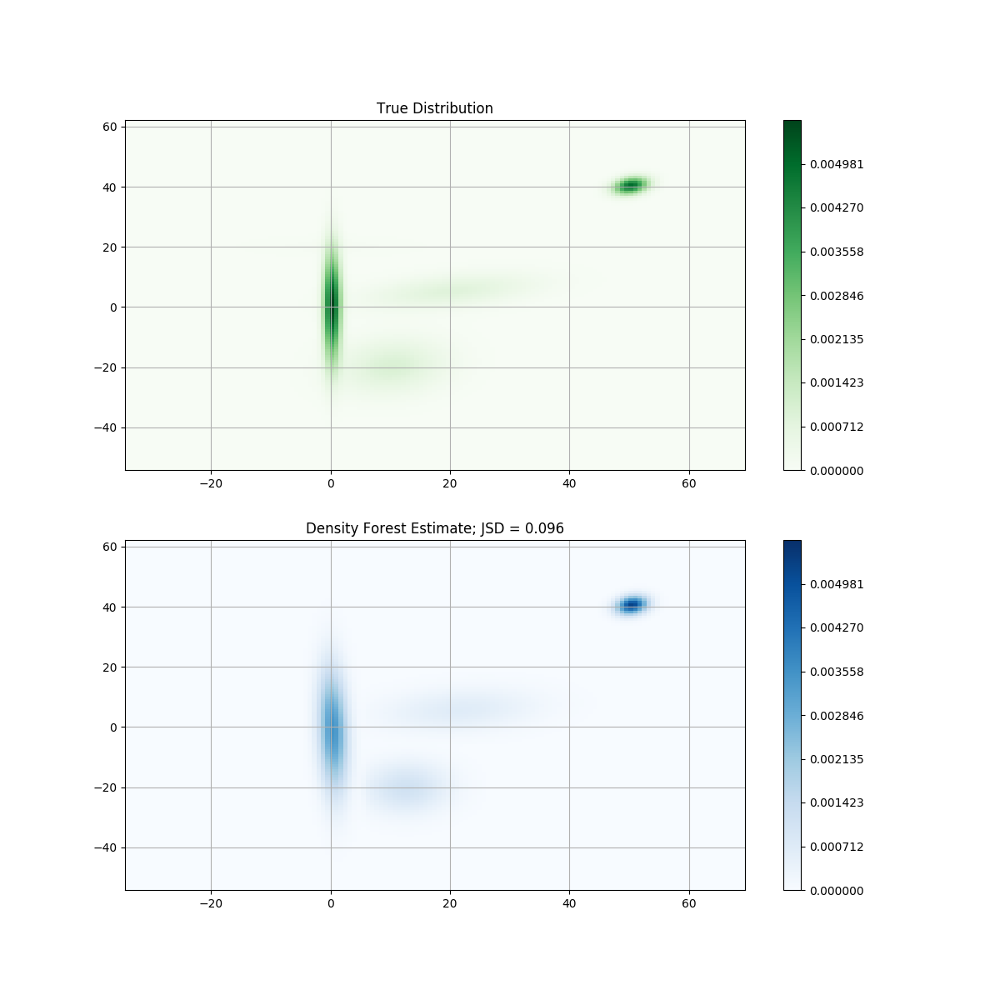
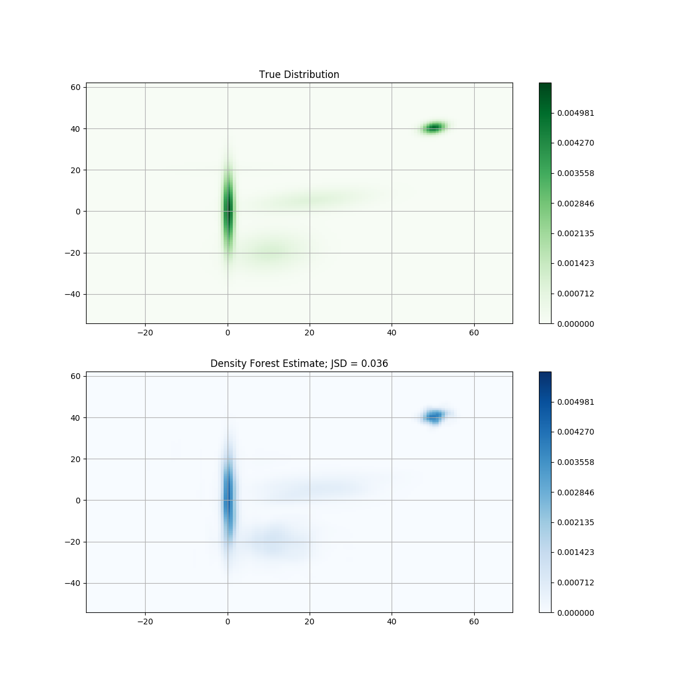
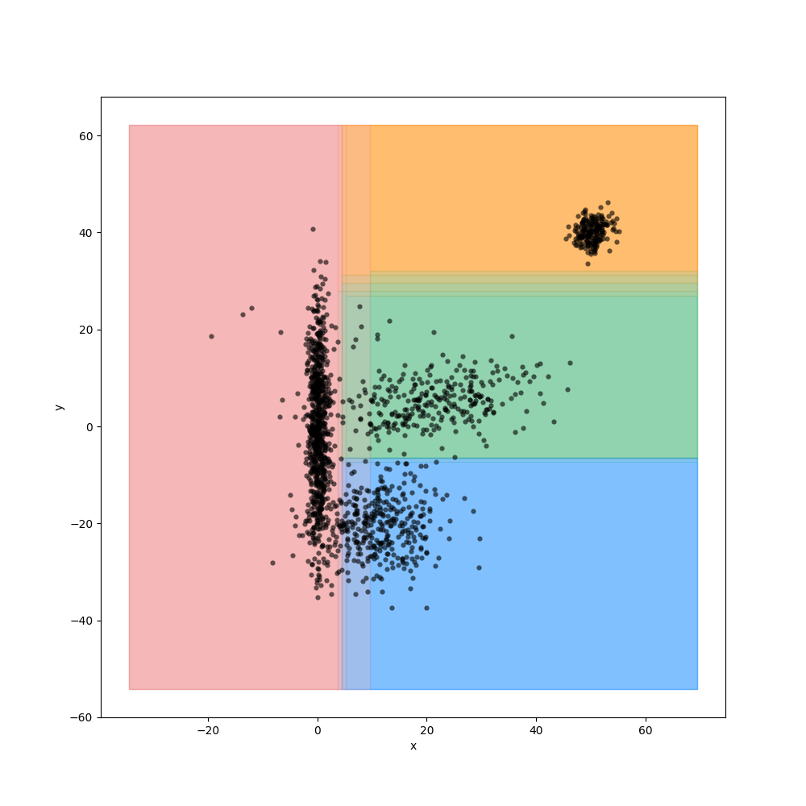

# Density Estimation Forests
## Using Kernel Density Estimation in Random Forests

### Introduction

In this project an implementation of random forests method for density estimation is presented. The approach is centered around the technical report _[Decision Forests for Classification,
Regression, Density Estimation, Manifold
Learning and Semi-Supervised Learning](https://www.microsoft.com/en-us/research/wp-content/uploads/2016/02/decisionForests_MSR_TR_2011_114.pdf)_. Following is the presentation of some of the steps, results, tests and comparisons.

### Random Forest Implementation

In this implementation, we use axis aligned split functions (called [stumps](https://en.wikipedia.org/wiki/Decision_stump)) to build binary trees by optimizing the [entropy gain](https://en.wikipedia.org/wiki/Differential_entropy) at each node. The key parameters to select for this method are: tree depth/entropy gain threshold, forest size, and randomness. 

The optimal depth of a tree will be data dependent. For that reason we first train a small set of trees on a fixed depth (_tune\_entropy\_threshold_ method, parameters _n_ and _depth_). Unlike forest size, where an increase will never yield worse results, too high a value will lead to [overfitting](https://en.wikipedia.org/wiki/Overfitting). We then take a look at how the optimal entropy gain varies with depth, as can seen in the following animation:

Optimizing an L-curve is an ill-posed regularization problem, that is handled in this implementation by finding the elbow of 'maximum depth' (point furthest from the line connecting the L's extremes), and averaging it out over _n_, as we can see here: 

This step is very expensive, since the depth is fixed with no a priori indication of where the optimal threshold is. A better approach would be to implement an online L-curve method (such as the ones discussed [here](https://www1.icsi.berkeley.edu/~barath/papers/kneedle-simplex11.pdf)) as a first pass to avoid initial over-splitting.

From the Microsoft article: 

_A key aspect of decision forests is the fact that its component trees are all randomly different from one another. This leads to de-correlation between the individual tree predictions and, in turn, to improved gen- eralization. Forest randomness also helps achieve high robustness with respect to noisy data.
Randomness is injected into the trees during the training phase. Two of the most popular ways of doing so are:_

* _[Random training data set sampling (e.g. bagging) ](https://en.wikipedia.org/wiki/Bootstrap_aggregating)_
* _[Randomized node optimization](https://en.wikipedia.org/wiki/Random_subspace_method)_

_These two techniques are not mutually exclusive and could be used together._

The method is tested by sampling a combination of gaussians. In order to introduce randomness the node optimization is randomized by parameter _rho_, which is proportional to the available parameter search space at each node split. With a 50% _rho_ and 5 trees, we the firsts results below:

Performance is harder to measure when using random forests for density estimation (as opposed to regression or classification) since we're in the unsupervised space. Here, the [Jensen-Shannon Divergence](https://en.wikipedia.org/wiki/Jensen%E2%80%93Shannon_divergence) is used as a comparison metric (whenever test data from a known distribution is used).

### Leaf prediction using KDE 

One of the main problems [Kernel Desnity Estimation](https://web.as.uky.edu/statistics/users/pbreheny/621/F10/notes/10-28.pdf) is the choice of bandwidth. Many of the approaches to find it rely on assumptions of the underlying distribution, and perform poorly in clustered, real-world data (although there are methods that incroporate an [adaptive bandwidth](https://indico.cern.ch/event/548789/contributions/2258640/attachments/1327011/1992522/kde.pdf) effectively). 

The module can work with any imlementation of the _Node_ class. In these firsts examples the _NodeGauss_ class was used, by fitting a gaussian distribution at each leaf. Below can be seen the results of using _NodeKDE_, where the compactness measure is still based on the differential entropy of a gaussian function but the leaf prediction is the result of the  KDE method.

Although it produces an overall better JSD, it's worth noting that the top right 'bump' is overfitting the noise a bit more. This is expected since the underlying distribution of our test data is a combination of Gaussians, and if a leaf totally encompasses a bump (as can be seen below) then fitting a Gaussian function will perform better than any non parametric technique. 

#### To do

* Try other entropy gain functions / compactness measures.
* Use online L-curve method for entropy threshold optimization.
* Other bottlenecks.
* Refactor to reuse framework in classification and regression.

